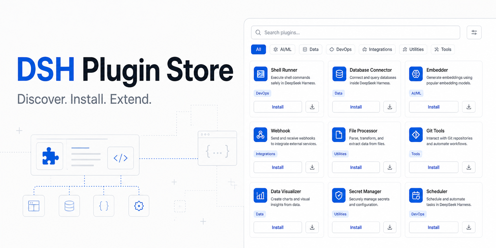
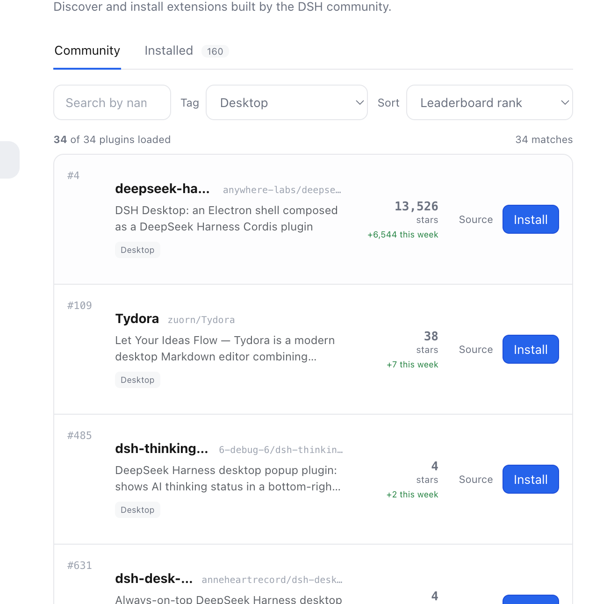
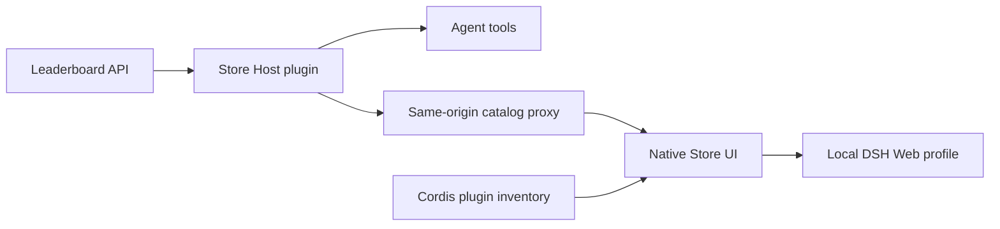

# DSH Plugin Store

> A native plugin marketplace for DeepSeek Harness.

[简体中文](README.zh.md)

[](https://github.com/sandbaseai/dsh-plugin-store/stargazers)
[](https://github.com/sandbaseai/dsh-plugin-store/releases/tag/v0.1.0-preview.2)
[](https://github.com/deepseek-ai/deepseek-harness)
[](https://dshpluginleaderboard.com/)
[](LICENSE)



**Discover, filter, install, and manage community plugins without leaving DeepSeek Harness.**

DSH Plugin Store turns the growing DeepSeek Harness plugin ecosystem into a searchable product experience. It uses live catalog data from [DSH Plugin Leaderboard](https://dshpluginleaderboard.com/) and adds Agent tools for programmatic discovery.

[Preview release](https://github.com/sandbaseai/dsh-plugin-store/releases/tag/v0.1.0-preview.2) · [Open the catalog](https://dshpluginleaderboard.com/) · [DeepSeek Harness](https://github.com/deepseek-ai/deepseek-harness) · [Report an issue](https://github.com/sandbaseai/dsh-plugin-store/issues)

## Try the preview

Install the immutable Preview 2 tag into your local DSH Web profile:

```bash
dsh plugin --profile web add github:sandbaseai/dsh-plugin-store#v0.1.0-preview.2
```

The explicit tag prevents a later change on `main` from silently changing the
code you install. Restart DSH Web, open **Settings**, and select **Store**. This
is a preview integration: review the source before installation and use the
development route below if you need a fully reproducible source-workspace build.

## What it solves

The DSH ecosystem is growing quickly, but finding a plugin still means searching GitHub, checking compatibility, and copying install commands by hand. DSH Plugin Store creates one discovery layer for developers and agents.

- Browse more than 2,900 community plugin repositories
- Search by name, repository, description, or category
- Filter with the complete leaderboard tag taxonomy
- Sort by leaderboard rank, GitHub stars, or weekly growth
- Install catalog entries into a local DSH Web profile
- Inspect plugins already loaded by Cordis
- Let agents search the same catalog through native tools

## Native Store experience

The current native Settings integration is being developed with the DeepSeek Harness `0.1.0-rc.5` source tree and is prepared for upstream collaboration. It includes:

<p align="center">
  
</p>

<p align="center"><em>Real preview: the Community view filtered by the Desktop tag.</em></p>

- `Community` and `Installed` tabs
- Server-side tag filtering and pagination
- Same-origin catalog proxy without browser CORS dependency
- Local profile installation with validation and error feedback
- Live Cordis Loader inventory
- Responsive light and dark UI

The hosted catalog remains available while the native integration is finalized against the public Harness package release.

## Agent tools

| Tool | Purpose |
| --- | --- |
| `store_search` | Search by name, description, and category. |
| `store_catalog` | Browse and rank catalog entries. |
| `store_install` | Return reviewed installation instructions. |

## Reproducible development installation

DeepSeek Harness is evolving rapidly. For the current source integration, clone
this repository into a Harness checkout, install the workspace, and build the
host and Web client faces:

```bash
cd /path/to/deepseek-harness
git clone https://github.com/sandbaseai/dsh-plugin-store.git packages/plugins/dsh-store
pnpm install
pnpm --filter @sandbaseai/dsh-plugin-store typecheck
pnpm --filter @sandbaseai/dsh-plugin-store bundle
```

Then enable the bundle in the Web profile:

```yaml
- name: '@sandbaseai/dsh-plugin-store'
  config:
    enabled: true
    catalogUrl: https://dshpluginleaderboard.com/api/catalog
    timeoutMs: 30000
```

The GitHub preview command installs the committed Host and Web client artifacts.
A stable npm package command will be documented after the public DSH package
versions catch up with the `rc.5` integration APIs. Until then, the
source-checkout path above remains the reproducible development route.

## Architecture



## Security

Installing a plugin may download and execute third-party code, including package lifecycle scripts. Review source repositories before installation. Enterprise deployments should place the catalog behind an organizational review and allowlist process.

The native installer validates GitHub repository identifiers and only accepts repositories returned by the configured catalog.

Report security issues through GitHub's
[private vulnerability reporting](https://github.com/sandbaseai/dsh-plugin-store/security/advisories/new),
not a public issue. See the full [security policy](SECURITY.md) for supported
versions, trust boundaries, and disclosure guidance.

## Roadmap

- [x] Searchable community catalog
- [x] Agent discovery tools
- [x] Native Community and Installed tabs
- [x] Tag filters, sorting, and pagination
- [x] Local Web profile installer
- [ ] Upstream review with DeepSeek Harness
- [ ] Stable npm release aligned with public DSH packages
- [ ] Update, disable, and uninstall workflows
- [ ] Enterprise catalog allowlists and audit events

## Help us reach 100 stars

If a native plugin marketplace would make DeepSeek Harness more useful for you, [star this repository](https://github.com/sandbaseai/dsh-plugin-store) and share one plugin workflow you want supported.

We are looking for:

- Plugin authors who want better distribution
- Harness users willing to test the native Store
- Enterprise teams with private catalog and audit requirements

Open an [issue](https://github.com/sandbaseai/dsh-plugin-store/issues) or join the discussion through the repository.

## Related projects

- [DeepSeek Harness](https://github.com/deepseek-ai/deepseek-harness)
- [DSH Plugin Leaderboard](https://dshpluginleaderboard.com/)
- [Sandbase Harness](https://github.com/sandbaseai/sandbase-harness)
- [DeepSeek Harness Handbook](https://github.com/sandbaseai/deepseek-harness-handbook)

## License

MIT
